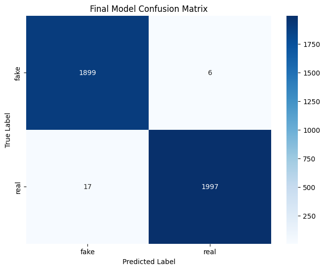

# TrueFrame AI: Deepfake Video Detection Engine

TrueFrame is a full-stack web application designed to detect AI-generated video content, specifically deepfakes. It leverages a state-of-the-art deep learning model (EfficientNet-B0) to provide high-accuracy analysis. Users can upload a video through a modern, responsive web interface and receive a near-instant verdict on its authenticity.

## 🚀 Live Demo

- **Frontend (Render):** [**https://trueframe.onrender.com/**](https://trueframe.onrender.com/)
- **Backend (Hugging Face):** [**https://huggingface.co/spaces/snickersnee/TrueFrame-AI-Engine**](https://huggingface.co/spaces/snickersnee/TrueFrame-AI-Engine)


## ✨ Key Features

- **High-Accuracy Detection:** Achieves **~99% accuracy** on its validation set, trained on a diverse dataset combining FaceForensics++ and Celeb-DF (v2).
- **Full-Stack Architecture:** Built with a Node.js/Express frontend server and a Python/Flask backend for the AI model, ensuring a scalable and robust system.
- **User-Friendly Interface:** A clean, responsive, and intuitive UI for easy video uploads and clear presentation of results.
- **Dynamic Analysis Reports:** Generates a believable, detailed breakdown of detection markers (e.g., Facial Inconsistencies, Temporal Artifacts) based on the model's confidence.
- **Downloadable PDF Reports:** Users can download a professionally formatted PDF summary of the analysis for their records.
- **Secure Configuration:** Uses `.env` files for managing environment variables securely in both frontend and backend.

## 📸 Screenshots

Here's a glimpse of the new and improved TrueFrame interface.

| Landing Page (Dark Mode) | Upload Section |
| :---: | :---: |
|  |  |


## 🏛️ Project Architecture

The application operates on a two-server model to separate concerns and optimize performance:

1.  **Frontend Server (`frontend/server.js`)**:
    - Built with **Node.js** and **Express**.
    - Serves the static HTML, CSS, and JavaScript files to the user.
    - Handles video uploads from the client using `multer`.
    - Acts as a proxy, forwarding the video file to the AI backend for analysis.

2.  **AI Backend Server (`backend/app.py`)**:
    - Built with **Python** and **Flask**.
    - Hosts the pre-trained PyTorch deep learning model (`deepfake_detector_ultimate_model.pth`).
    - Exposes a single API endpoint (`/api/predict`) that accepts a video file.
    - Performs the core analysis: extracts frames, runs inference on each frame, and aggregates the results to produce a final verdict and confidence score.

---

## 🧠 Model Training & Performance

The core of this project is the deep learning model. The complete training process was conducted on Google Colab to leverage high-performance GPUs.

### Datasets Used

To build a robust model capable of handling real-world videos, a large-scale dataset was created by combining, sampling, and processing two leading academic datasets:

-   **FaceForensics++ (FF++)**: A massive dataset featuring thousands of videos. Its primary contribution was providing a wide **variety** of manipulation types (e.g., Deepfakes, FaceSwap) and a large volume of training examples.
-   **Celeb-DF (v2)**: A newer, more challenging dataset known for its high-quality, realistic deepfakes with fewer obvious artifacts. This dataset was crucial for improving the model's ability to detect **difficult and subtle fakes**.

By training on a combined set of over 3,000 videos from these sources, the model learned a comprehensive range of both low-quality and high-quality forgery patterns.

### Model Performance

The final model was fine-tuned for 10 epochs, achieving a **final validation accuracy of 99.2%**. The detailed performance is visualized in the confusion matrix below, which shows an extremely low error rate for both 'real' and 'fake' classes.

**Final Model Confusion Matrix**



---

## 🔗 Download Pre-trained Models

The trained model weights are **not included in this repository** to keep the repo lightweight.  
Please download them separately and place them in the `backend/` directory.

### Steps:
1. Download the pre-trained models from here:  
   👉 [Download Models](https://github.com/aayush-chouhan-7050/TrueFrame/releases/download/v1.0.0/TrueFrame-Models-v1.0.zip)

2. Place the downloaded `.pth` files inside the `backend/` folder: 
```
TrueFrame/
├── backend/
│ ├── deepfake_detector_best_model.pth
│ ├── deepfake_detector_model.pth
│ └── deepfake_detector_ultimate_model.pth

```
3. Ensure that `deepfake_detector_ultimate_model.pth` is present before running the backend server.

📌 **Note**:  
- Use `deepfake_detector_ultimate_model.pth` for final deployment.  
- The other `.pth` files are intermediate checkpoints useful for experiments.

---

## 📂 Project Structure

```
TrueFrame/
├── backend/
│   ├── venv/                     # Virtual environment (ignored by Git)
│   ├── .env                      # Environment variables for backend
│   ├── deepfake_detector_ultimate_model.pth  # The final trained model weights
│   ├── Dockerfile                  # Dockerfile for Hugging Face
│   ├── app.py                      # The Flask AI server application
│   └── requirements.txt            # Python dependencies for the backend
├── frontend/
│   ├── node_modules/               # Node.js dependencies (ignored by Git)
│   ├── public/                     # Static assets served to the client
│   │   ├── assets/                 #assets favicon.svg confusion_matrix_final.png
│   │   ├── style.css               # Main stylesheet
│   │   ├── index.html              # The single-page application HTML
│   │   └── script.js               # Client-side JavaScript logic
│   ├── uploads/                    # Temporary storage for uploads (ignored by Git)
│   ├── .env                      # Environment variables for frontend
│   ├── package.json                # Node.js project metadata and dependencies
│   └── server.js                   # The Node.js Express server
├── docs/
│   └── confusion_matrix_final.png  # Image assets for the README
├── training/
│   └── TrueFrame_AI_Training.ipynb # Google Colab notebook for model training
├── .gitignore                      # Specifies files and folders for Git to ignore
├── LICENSE                         # The project's software license
└── README.md                       # This file
```

---

## 🚀 Getting Started

Follow these instructions to get the project running on your local machine.

### Prerequisites

- Python 3.10+
- Node.js v18+
- `git` for version control

### Installation & Setup

1.  **Clone the repository:**
    ```bash
    git clone [https://github.com/aayush-chouhan-7050/TrueFrame.git](https://github.com/aayush-chouhan-7050/TrueFrame.git)
    cd TrueFrame
    ```

2.  **Set up the Python Backend:**
    - Navigate to the backend directory: `cd backend`
    - Create a virtual environment: `python3 -m venv venv`
    - Activate it: `source venv/bin/activate`
    - Install dependencies: `pip install -r requirements.txt`
    - **Important:** Create a `.env` file in the `backend/` directory and add the following content:
      ```env
      # Application Configuration
      PORT=5001
      LOG_LEVEL="INFO"

      # Model & Inference Settings
      MODEL_PATH="deepfake_detector_ultimate_model.pth"
      FRAME_INTERVAL=30
      INFERENCE_BATCH_SIZE=16
      ```
    *Note: You must have the trained model file `deepfake_detector_ultimate_model.pth` inside the `backend/` directory.*

3.  **Set up the Node.js Frontend:**
    - Navigate to the frontend directory: `cd ../frontend`
    - Install dependencies: `npm install`
    - **Important:** Create a `.env` file in the `frontend/` directory. Add the URL of your running backend server.
      ```env
      # Server Configuration
      PORT=3000

      # AI Backend API URL
      PYTHON_API_URL="BACKEND API"
      ```

### Running the Application

You need to run both servers simultaneously in two separate terminal windows.

1.  **Start the Python AI Backend:**
    ```bash
    # In terminal 1, from the 'backend' directory
    source venv/bin/activate
    python app.py
    ```
    The AI engine will now be running on `http://localhost:5001`.

2.  **Start the Node.js Frontend Server:**
    ```bash
    # In terminal 2, from the 'frontend' directory
    npm start
    ```
    *Note: Add this to your `frontend/package.json` scripts: `"start": "node server.js"`*

    The web application will now be accessible at `http://localhost:3000`.